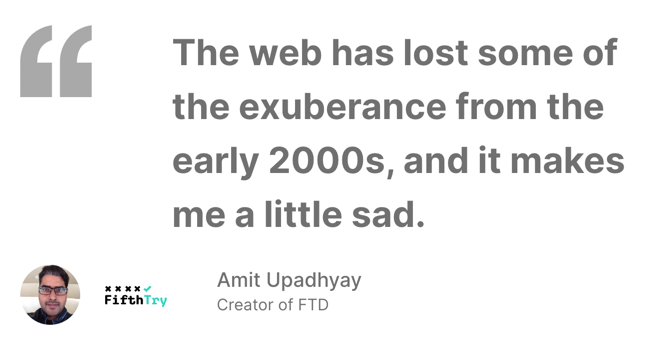
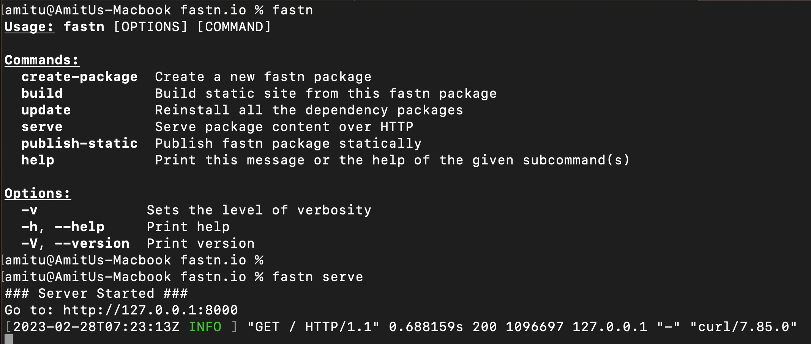

<div align="center">

 
 
 
[](https://fastn.com/discord/)

</div>

<div align="center">
    
</div>


# `fastn` - Full-stack Web Development Made Easy

`ftd` is a programming language for building user interfaces and content centric
websites. `ftd` is easy to learn, especially for non programmers, but does not
compromise on what you can build with it.

`fastn` is a web-framework, a content management system, and an integrated
development environment for `ftd`. `fastn` is a webserver, and compiles `ftd`
to HTML/CSS/JS, and can be deployed on your server, or on `fastn cloud` by
FifthTry.

The quickest way to learn `fastn` is the [short video course we have created:
expander](https://fastn.com/expander/), it takes you through the basics.

Then checkout the [frontend](https://fastn.com/frontend/) and [backend](https://fastn.com/backend/) sections of
our documentation.

## `ftd`: Programming Language For The Next Billion Programmers

`ftd` is designed with minimal and uniform syntax, and at first glance 
does not even look like a programming language.


**No quotes for string, multi-line strings are easy**
```ftd
-- amitu: Hello World! 😀

-- amitu:

you can also write multiline messages easily!

no quotes. and **markdown** is *supported*.
```

We have called a "function" named "amitu" with "Hello World! 😀" as input, 
yet it does not feel technical.

This is what it produces:

<a href="https://fastn.com/#ftd-programming-language-for-the-next-billion-programmers" rel="nofollow"></a>


Learn more about [`ftd` Programming Language](https://fastn.com/ftd/).


## There are a lot of ready made `ftd` components available today

**Ready made components can be imported and used.**

```ftd
-- import: fifthtry.github.io/bling/quote

-- quote.charcoal: Amit Upadhyay
label: Creator of FTD
avatar: $fastn-assets.files.images.amitu.jpg
logo: $fastn-assets.files.images.logo-fifthtry.svg

The web has lost some of the exuberance from the
early 2000s, and it makes me a little sad.
```

[](https://fastn.com/#there-are-a-lot-of-ready-made-ftd-components-available-today)

## Or you can create your own components

**Creating a custom component**

```ftd
-- component toggle-text:
boolean $current: false
caption title:

-- ftd.text: $toggle-text.title
align-self: center
text-align: center
color if { toggle-text.current }: #D42D42
color: $inherited.colors.cta-primary.text
background.solid: $inherited.colors.cta-primary.base
$on-click$: $ftd.toggle($a = $toggle-text.current)
border-radius.px: 5

-- end: toggle-text

-- toggle-text: `ftd` is cool!
```

<a href="https://fastn.com/#or-you-can-create-your-own-components" align="center" rel="nofollow"></a>

`ftd`'s event handling capabilities can be used for form validation, ajax
requests etc, to create fully functional frontend applications.


## You Use `fastn` To Work With `ftd`

We ship pre built binaries for Linux, Mac and Windows.

```shell
curl -fsSL https://fastn.com/install.sh | bash
```

[](https://fastn.com/#you-use-fastn-to-work-with-ftd)


## Integrated Web Development Experience

`ftd` and `fastn` come with package management, web server, opinionated design
system, dark mode and responsive by default.

If you are getting started with frontend development, `fastn` framework takes
care of a lot of things for you, and all you have to focus on is your product.

We are working towards our own hosted web based IDE, version controlled code
hosting and collaboration platform so you and your team gets a one stop solution
for building websites.


## `fastn` for Static Sites

`fastn` websites can be compiled into static html, js, css etc, and can be
deployed on any static hosting providers eg [Github Pages](https://fastn.com/github-pages/),
[Vercel](https://fastn.com/vercel/)  etc.

**`ftd` source code of the page you are reading**

```ftd
-- import: fifthtry.github.io/bling/quote
-- import: fastn.com/ftd as ftd-index

-- my-ds.page: Overview of `fastn` and `ftd`

`ftd` is a programming language for building user interfaces and content centric
websites. `ftd` is easy to learn, especially for non programmers, but does not
compromise on what you can build with it.
```

`ftd` is a good alternative for content websites like blogs, knowledge bases,
portfolio websites, project and marketing websites etc. It is cheap, fast, and
requires little maintenance.

[](https://fastn.com/#fastn-for-static-sites)

## Data Driven Website

**fetching data from API**

```ftd
-- import: fastn/processors as pr

-- result r:
$processor$: pr.http
url: https://api.github.com/search/repositories
sort: stars
order: desc
q: language:python
```

**Working With SQL Is Breeze**

```ftd
-- import: fastn/processors as pr

-- people:
$processor$: pr.package-query
db: db.sqlite

SELECT * FROM user;


-- show-person: $p
$loop$: $people as $p
```

`fastn` can be used to create data driven website, dashboards.

**Dynamic URLs**

```ftd
-- fastn.dynamic-urls:

# Profile Page
url: /<string:username>/
document: profile.ftd
```

`fastn` can be used for creating a lot of web application backends as well.

## Upcoming WASM Support

We are working on `wasm` support so developers can extend `ftd's` standard
libraries and offer access to more backend functionalities.


<a href="https://fastn.com/#upcoming-wasm-support" rel="nofollow"></a>


## Hosting Dynamic Sites

For dynamic sites you can deploy `fastn` cli on the platform of your choice. We
ship ready made Docker containers that you can add to your infrastructure.

## `fastn` Cloud

We also offer our own hosting solution for your static and dynamic sites. Using
`fastn` Cloud frees you from devops needs, and you get a fully integrated,
managed hosting solution, that a non programmers can use with ease.


## Contributors


<!-- ALL-CONTRIBUTORS-LIST:START - Do not remove or modify this section -->
<!-- prettier-ignore-start -->
<!-- markdownlint-disable -->
<table>
  <tbody>
    <tr>
      <td align="center" valign="top" width="14.28%"><a href="https://github.com/Arpita-Jaiswal"><br /><sub><b>Arpita Jaiswal</b></sub></a><br /><a href="https://github.com/fastn-stack/fastn/commits?author=Arpita-Jaiswal" title="Code">💻</a> <a href="https://github.com/fastn-stack/fastn/commits?author=Arpita-Jaiswal" title="Documentation">📖</a> <a href="#example-Arpita-Jaiswal" title="Examples">💡</a> <a href="#eventOrganizing-Arpita-Jaiswal" title="Event Organizing">📋</a> <a href="#ideas-Arpita-Jaiswal" title="Ideas, Planning, & Feedback">🤔</a> <a href="#maintenance-Arpita-Jaiswal" title="Maintenance">🚧</a> <a href="#mentoring-Arpita-Jaiswal" title="Mentoring">🧑‍🏫</a> <a href="https://github.com/fastn-stack/fastn/pulls?q=is%3Apr+reviewed-by%3AArpita-Jaiswal" title="Reviewed Pull Requests">👀</a> <a href="#tool-Arpita-Jaiswal" title="Tools">🔧</a> <a href="https://github.com/fastn-stack/fastn/commits?author=Arpita-Jaiswal" title="Tests">⚠️</a> <a href="#tutorial-Arpita-Jaiswal" title="Tutorials">✅</a> <a href="#video-Arpita-Jaiswal" title="Videos">📹</a> <a href="#blog-Arpita-Jaiswal" title="Blogposts">📝</a></td>
      <td align="center" valign="top" width="14.28%"><a href="https://www.fifthtry.com"><br /><sub><b>Amit Upadhyay</b></sub></a><br /><a href="https://github.com/fastn-stack/fastn/commits?author=amitu" title="Code">💻</a> <a href="https://github.com/fastn-stack/fastn/commits?author=amitu" title="Documentation">📖</a> <a href="#example-amitu" title="Examples">💡</a> <a href="#eventOrganizing-amitu" title="Event Organizing">📋</a> <a href="#ideas-amitu" title="Ideas, Planning, & Feedback">🤔</a> <a href="#maintenance-amitu" title="Maintenance">🚧</a> <a href="#mentoring-amitu" title="Mentoring">🧑‍🏫</a> <a href="https://github.com/fastn-stack/fastn/pulls?q=is%3Apr+reviewed-by%3Aamitu" title="Reviewed Pull Requests">👀</a> <a href="#tool-amitu" title="Tools">🔧</a> <a href="https://github.com/fastn-stack/fastn/commits?author=amitu" title="Tests">⚠️</a> <a href="#tutorial-amitu" title="Tutorials">✅</a> <a href="#video-amitu" title="Videos">📹</a> <a href="#blog-amitu" title="Blogposts">📝</a></td>
      <td align="center" valign="top" width="14.28%"><a href="https://github.com/Heulitig"><br /><sub><b>Rithik Seth</b></sub></a><br /><a href="https://github.com/fastn-stack/fastn/commits?author=Heulitig" title="Code">💻</a> <a href="https://github.com/fastn-stack/fastn/commits?author=Heulitig" title="Documentation">📖</a> <a href="https://github.com/fastn-stack/fastn/commits?author=Heulitig" title="Tests">⚠️</a> <a href="#ideas-Heulitig" title="Ideas, Planning, & Feedback">🤔</a> <a href="https://github.com/fastn-stack/fastn/pulls?q=is%3Apr+reviewed-by%3AHeulitig" title="Reviewed Pull Requests">👀</a> <a href="#maintenance-Heulitig" title="Maintenance">🚧</a> <a href="#blog-Heulitig" title="Blogposts">📝</a></td>
      <td align="center" valign="top" width="14.28%"><a href="https://github.com/gsalunke"><br /><sub><b>Ganesh Salunke</b></sub></a><br /><a href="https://github.com/fastn-stack/fastn/commits?author=gsalunke" title="Code">💻</a> <a href="https://github.com/fastn-stack/fastn/commits?author=gsalunke" title="Documentation">📖</a> <a href="https://github.com/fastn-stack/fastn/commits?author=gsalunke" title="Tests">⚠️</a> <a href="#ideas-gsalunke" title="Ideas, Planning, & Feedback">🤔</a> <a href="#mentoring-gsalunke" title="Mentoring">🧑‍🏫</a> <a href="https://github.com/fastn-stack/fastn/pulls?q=is%3Apr+reviewed-by%3Agsalunke" title="Reviewed Pull Requests">👀</a></td>
      <td align="center" valign="top" width="14.28%"><a href="https://github.com/priyanka9634"><br /><sub><b>Priyanka</b></sub></a><br /><a href="https://github.com/fastn-stack/fastn/commits?author=priyanka9634" title="Code">💻</a> <a href="https://github.com/fastn-stack/fastn/commits?author=priyanka9634" title="Documentation">📖</a></td>
      <td align="center" valign="top" width="14.28%"><a href="https://github.com/gargajit"><br /><sub><b>Ajit Garg</b></sub></a><br /><a href="https://github.com/fastn-stack/fastn/commits?author=gargajit" title="Code">💻</a> <a href="https://github.com/fastn-stack/fastn/commits?author=gargajit" title="Documentation">📖</a> <a href="#blog-gargajit" title="Blogposts">📝</a></td>
      <td align="center" valign="top" width="14.28%"><a href="https://github.com/AbrarNitk"><br /><sub><b>Abrar Khan</b></sub></a><br /><a href="https://github.com/fastn-stack/fastn/commits?author=AbrarNitk" title="Code">💻</a> <a href="https://github.com/fastn-stack/fastn/commits?author=AbrarNitk" title="Documentation">📖</a> <a href="https://github.com/fastn-stack/fastn/pulls?q=is%3Apr+reviewed-by%3AAbrarNitk" title="Reviewed Pull Requests">👀</a> <a href="https://github.com/fastn-stack/fastn/commits?author=AbrarNitk" title="Tests">⚠️</a></td>
    </tr>
    <tr>
      <td align="center" valign="top" width="14.28%"><a href="https://github.com/sharmashobhit"><br /><sub><b>Shobhit Sharma</b></sub></a><br /><a href="https://github.com/fastn-stack/fastn/commits?author=sharmashobhit" title="Code">💻</a> <a href="https://github.com/fastn-stack/fastn/commits?author=sharmashobhit" title="Documentation">📖</a> <a href="https://github.com/fastn-stack/fastn/commits?author=sharmashobhit" title="Tests">⚠️</a></td>
      <td align="center" valign="top" width="14.28%"><a href="http://fifthtry.com"><br /><sub><b>Aviral Verma</b></sub></a><br /><a href="https://github.com/fastn-stack/fastn/commits?author=AviralVerma13" title="Code">💻</a> <a href="https://github.com/fastn-stack/fastn/commits?author=AviralVerma13" title="Documentation">📖</a> <a href="https://github.com/fastn-stack/fastn/commits?author=AviralVerma13" title="Tests">⚠️</a> <a href="#ideas-AviralVerma13" title="Ideas, Planning, & Feedback">🤔</a></td>
    </tr>
  </tbody>
</table>

<!-- markdownlint-restore -->
<!-- prettier-ignore-end -->

<!-- ALL-CONTRIBUTORS-LIST:END -->


## License

This project is licensed under the terms of the **BSD 3-Clause License**

[](https://opensource.org/licenses/BSD-3-Clause)


## Examples

The following examples are intended for testing purposes and showcase the range of capabilities of ftd language, from basic to advanced use cases. These examples are provided to ensure the proper functioning of ftd and to highlight its diverse features.

You can find the examples at the following link: https://fastn-stack.github.io/fastn/
