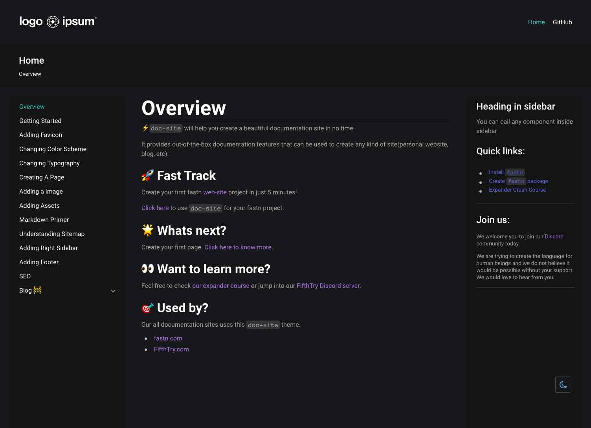

# Welcome to your [FASTN site](https://fastn.io/)

FASTN Blank Package Template Repo

# Overview

⚡️ [doc-site](https://fastn-community.github.io/doc-site/) will help you create a beautiful documentation site in no time.

It provides out-of-the-box documentation features that can be used to create any kind of site(personal website, blog, etc).

## How it looks?

## 🚀 Fast Track

Use this fastn template to create your first [fastn web-site](https://fastn.com/expander/hello-world/-/build/) project in just 5 minutes!

## 🌟 Whats next?

Create your first page. [Click here to know more](https://fastn-community.github.io/doc-site/page/)

## 👀 Want to learn more?

Feel free to check our [expander course](https://fastn.com/expander/) or jump into our [FifthTry Discord server](https://discord.gg/bucrdvptYd).

