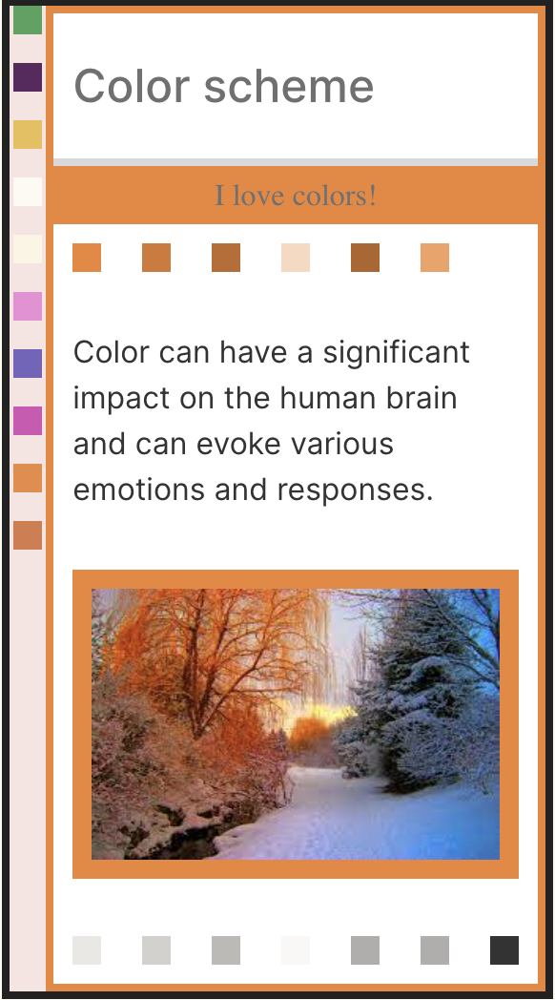

# Boldness and Balance: The Dark Flame Color Scheme 

Are you tired of the same old monochromatic color schemes and want to add a touch of boldness to your designs? Look no further than the Dark Flame color scheme package! This package offers a sleek and modern color palette that perfectly balances black and orange tones to bring a new level of intensity to your designs.

In dark mode, this package features a sleek and stylish black as the primary color, paired with a bold and radiant orange as the secondary color. The combination of these two hues creates a mysterious yet fiery look, perfect for a variety of projects. The orange adds a pop of color to an otherwise dark palette, making it a great choice for websites or applications that require a sophisticated and modern look.

For light mode, the package features a classic white as the primary color and the same vibrant orange as the secondary color. This combination creates a warm and inviting look, perfect for websites or applications that need to convey a friendly and approachable feel. The orange provides a cheerful accent to the white, making it a great choice for projects that want to evoke a happy and positive mood.

Whether you're designing a website, creating an application, or developing a brand, the Dark Flame Color Scheme Package has got you covered. With its versatile and stylish palette, you can create a beautiful and captivating design that is sure to engage and impress your audience.

&nbsp;&nbsp;&nbsp;&nbsp;&nbsp;&nbsp;&nbsp;&nbsp; 
