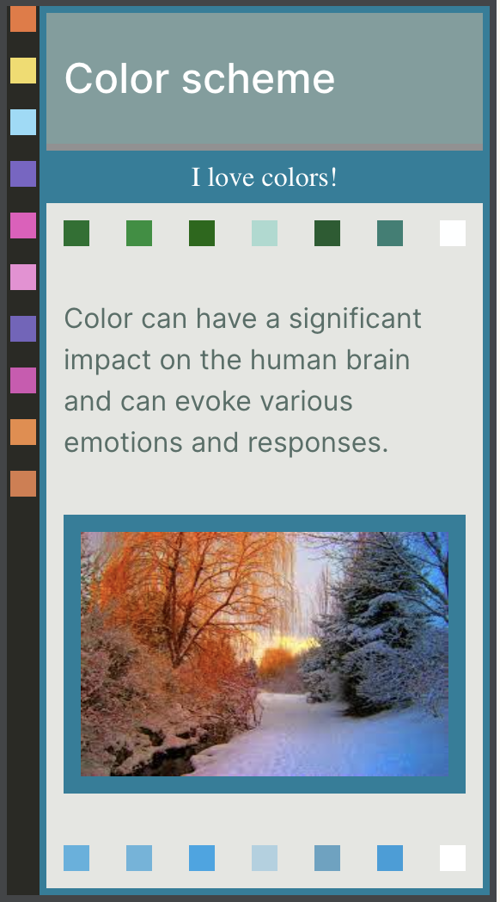
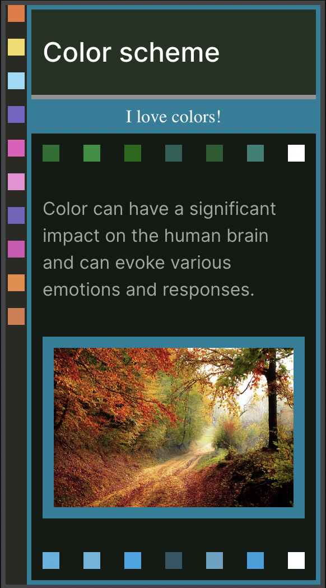

# Bringing Nature to Your Designs: The Forest Color Scheme Package

Are you tired of using the same old color palettes in your designs? Do you want to bring a touch of nature to your next project? Look no further than the Forest Color Scheme Package.

Inspired by the lush greens and earthy browns of a forest, this color scheme offers a rich and warm feel. The colors range from a soft, muted green to a deep, rich brown, giving you the flexibility to create a variety of looks for your designs. Whether you want to evoke a sense of calm and serenity or add a pop of energy, this color scheme has you covered.

The Forest Color Scheme Package is perfect for nature-inspired designs, from logos to websites to product packaging. It is especially ideal for projects targeting eco-conscious consumers or those focused on sustainability.

So why settle for generic color palettes when you can bring the beauty of the forest to your designs? Try the Forest Color Scheme Package today and see the difference it can make.

&nbsp;&nbsp;&nbsp;&nbsp;&nbsp;&nbsp;&nbsp;&nbsp; 
